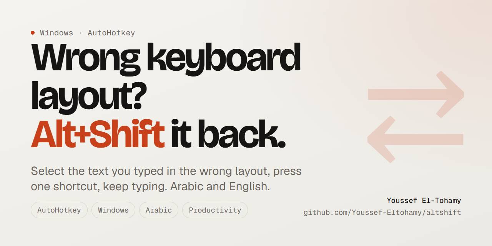
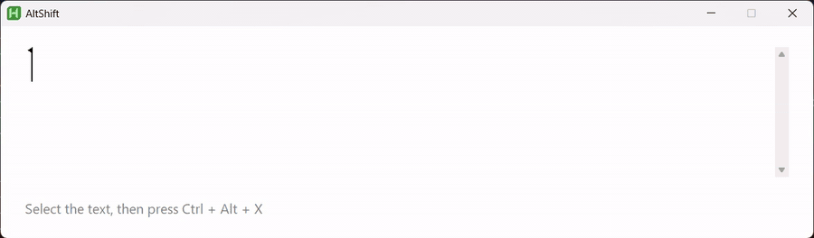

<div align="center">



**Fix text you typed with the wrong keyboard layout (Arabic and English) with one shortcut.**

*Named after the muscle memory it replaces.*

[](https://github.com/Youssef-Eltohamy/altshift/actions/workflows/test.yml)
[](LICENSE)
[](#install)
[](https://www.autohotkey.com/)

[The problem](#the-problem) · [Usage](#usage) · [Install](#install) · [How it works](#how-it-works) · [بالعربى](#بالعربى)

</div>

---

## The problem

You start typing in Arabic, but the keyboard was still on English. You end up with:

```
hgsghl ugd;l
```

...instead of `السلام عليكم`. Or the reverse, English typed while the layout was Arabic:

```
اثممخ صخقمي        →  hello world
```

Today you delete it and retype. **AltShift** re-maps it by key position instead.

## Usage

1. Select the mistyped text.
2. Press <kbd>Ctrl</kbd>+<kbd>Alt</kbd>+<kbd>X</kbd>.

<p align="center"></p>

The text is replaced in place **and the window's input language is switched**, so you can keep typing
correctly, exactly as if you had pressed <kbd>Alt</kbd>+<kbd>Shift</kbd> and retyped the whole thing.

The direction is detected automatically from the selection: mostly Arabic → convert to English,
mostly Latin → convert to Arabic. Your clipboard is restored afterwards.

## Install

**One line in PowerShell:**

```powershell
irm https://raw.githubusercontent.com/Youssef-Eltohamy/altshift/main/install.ps1 | iex
```

Prefer to read a script before running it? Good instinct. Download it first:

```powershell
irm https://raw.githubusercontent.com/Youssef-Eltohamy/altshift/main/install.ps1 -OutFile install.ps1
```

No admin rights, no `winget`, nothing installed system-wide. The script:

1. downloads a **pinned, checksum-verified** portable copy of AutoHotkey v2 (about 3 MB) into `%LOCALAPPDATA%\AltShift\ahk`;
2. copies `AltShift.ahk` next to it and runs its self-test;
3. adds a Startup shortcut and launches the tool.

Re-running it is safe: it keeps your `settings.ini` and skips the download if the same version is already there.

**Options** (the same one-liner, wrapped so it accepts parameters):

```powershell
& ([scriptblock]::Create((irm https://raw.githubusercontent.com/Youssef-Eltohamy/altshift/main/install.ps1))) -NoStartup
```

| Flag | Effect |
|------|--------|
| `-NoStartup` | do not run at login |
| `-NoLaunch` | install only, do not start it now |
| `-Dest <path>` | install somewhere other than `%LOCALAPPDATA%\AltShift` |

**Manual:** install [AutoHotkey v2](https://www.autohotkey.com/), clone this repo, double-click `AltShift.ahk`.

## Uninstall

```powershell
irm https://raw.githubusercontent.com/Youssef-Eltohamy/altshift/main/uninstall.ps1 | iex
```

Stops the running copy, removes the Startup shortcut and deletes `%LOCALAPPDATA%\AltShift` (including your
`settings.ini`). Nothing else on the machine is touched.

## Settings

Right-click the tray icon → **فتح الإعدادات**, or edit `settings.ini`:

```ini
[General]
; ^ = Ctrl   ! = Alt   + = Shift   # = Win
Hotkey=^!x
```

Press <kbd>Ctrl</kbd>+<kbd>Alt</kbd>+<kbd>R</kbd> to reload after editing.
If the hotkey is invalid the script falls back to <kbd>Ctrl</kbd>+<kbd>Alt</kbd>+<kbd>X</kbd> and tells you.

## How it works

The two layouts put different characters on the same physical keys. `h` on a US layout and `ا` on
Arabic 101 are the same key, so the fix is a character-for-character re-map, not a translation.

Three details that are easy to get wrong:

- **Ligature keys.** On Arabic 101, `b` produces two characters (`لا`), and <kbd>Shift</kbd>+`g/t/b`
  produce `لأ` / `لإ` / `لآ`. The reverse pass reads two characters ahead before falling back to one.
- **It never installs a keyboard layout.** Switching with `LoadKeyboardLayout` on a hardcoded id adds a
  duplicate entry to the language bar for the whole session if the user does not already have that exact
  variant. Instead the script enumerates the layouts Windows has already loaded and picks the Arabic or
  English one the user actually has, whichever variant that is.
- **Copy/paste uses scan codes, not letters.** The script changes the active keyboard layout, and
  AutoHotkey resolves `Send "^c"` *through the active layout*: under an Arabic layout there is no
  `c` key to resolve, so the copy silently fails. `Send "^{sc02E}"` addresses the physical key and is
  immune to this. Without it the tool breaks itself on the second use.

## Known limitations

`ل` followed by `ا` is genuinely ambiguous in the Arabic → English direction: the same two characters
come from either the single key `b` or the pair `g`+`h`. The script prefers `b`, since a lone `b` is far
more common in English than the digraph `gh`. This is covered by an explicit test rather than hidden.

Symbols and digits are deliberately left untouched, you rarely want `2024` or `@gmail.com` rewritten.

## Development

```powershell
# the interpreter the installer put down (or use your own AutoHotkey v2 install)
$ahk = "$env:LOCALAPPDATA\AltShift\ahk\AutoHotkey64.exe"

# unit tests - the character maps, both directions; exit code = number of failures
& $ahk AltShift.ahk --selftest

# end-to-end - drives a real edit control through the real hotkey
& $ahk AltShift.test.ahk

# install from the working copy instead of GitHub
.\install.ps1 -NoStartup

# regenerate the icon set
pwsh -File assets/build-icon.ps1
```

CI runs the self-test on every push, and also runs `install.ps1` end-to-end on a clean `windows-latest`
runner so the one-liner is proven against a machine that has never seen AutoHotkey.

## License

MIT, see [LICENSE](LICENSE).

---

<div dir="rtl">

## بالعربى

بتبدأ تكتب عربى والكيبورد لسه على الإنجليزى، فيطلع كلام مكرقط زى `hgsghl ugd;l` بدل «السلام عليكم».

**الحل:** حدّد الجملة واضغط <kbd>Ctrl</kbd>+<kbd>Alt</kbd>+<kbd>X</kbd>. النص بيتصلح مكانه، ولغة الإدخال بتتبدّل كمان عشان تكمل كتابة صح، كأنك ضغطت <kbd>Alt</kbd>+<kbd>Shift</kbd> وكتبت الجملة تانى.

الاتجاه بيتحدد أوتوماتيك حسب نوع الحروف فى التحديد، والكليبورد بيرجع لحالته بعد العملية.

**التسطيب:** افتح `PowerShell` والزق السطر اللى فى قسم `Install` فوق. من غير صلاحيات أدمن، ومن غير تسطيب أى حاجة على مستوى الجهاز: بيحمّل نسخة محمولة من `AutoHotkey v2` متحقق منها بـ`checksum` جوه `%LOCALAPPDATA%\AltShift`، وبيشغّل اختبار ذاتى، وبيضيف اختصار فى `Startup`. تشغيله تانى آمن وبيحافظ على إعداداتك.

**الإزالة:** سطر واحد فى قسم `Uninstall` بيوقف الأداة ويمسح المجلد واختصار الـ`Startup`، ومش بيلمس أى حاجة تانية على الجهاز.

**الإعدادات:** كليك يمين على أيقونة شريط المهام ← «فتح الإعدادات». تقدر تغيّر الاختصار من هناك.

</div>
